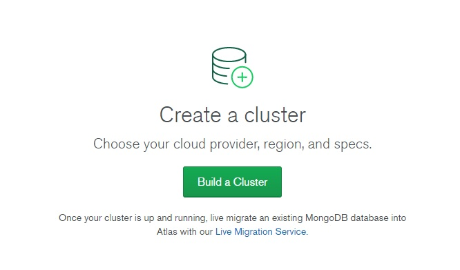
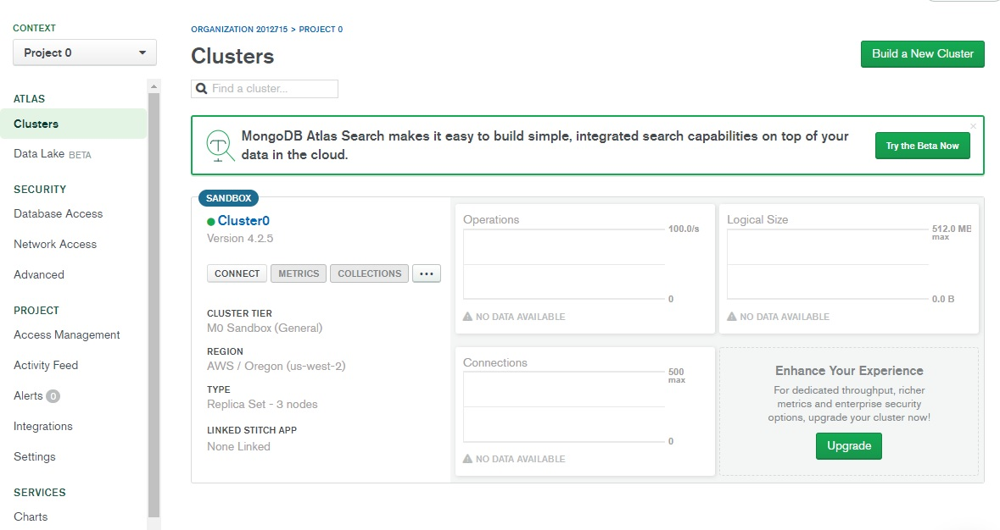
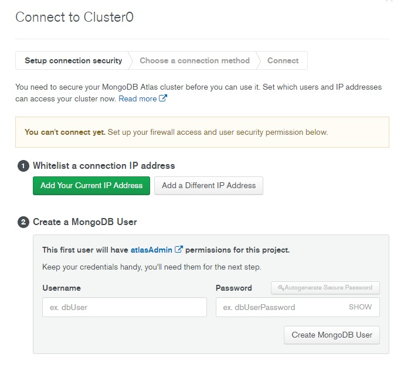

*Apollo Server* is an open-source GraphQL server for Node.js. It can be used with *Apollo Client* on the frontend to create a fullstack application. In this tutorial we will setup our own server for video game data. Once we have a working API, we can connect it to *Mongodb Atlas*, and deploy it to *Heroku*.

### What is a GraphQL server?

A GraphQL server (i.e. *apollo-server*) is comparable with a REST server (i.e. *express*) that only uses a single endpoint. Instead of passing our query data into the URL endpoint and parameters, GraphQL allows us to structure our own queries for the exact data we are looking for. All of our data is accessible on the same graph, served from a single endpoint, and must be requested specifically.

## Apollo Server Setup

To start, make sure you have Node JS installed (download it [here]([Download | Node.js](https://nodejs.org/en/download/))) then setup a new node project with the following commands

```bash
mkdir games-server
cd games-server
npm init -y
npm install apollo-server graphql mongoose
```

This will create a new folder, initialize a node project, and add our dependencies to it. Here **apollo-server** is our server setup, **graphql** is our query language, and **mongoose** allows us to interact with MongoDB. We can also install *nodemon* for development purposes

```bash
npm install --save-dev nodemon
```

Next, add the following scripts to to the newly created `package.json` file

```json
"start": "node index.js",
"dev": "nodemon index.js",
```

The `start` command will run in production and the `dev` command will be useful when we are making changes to the API. The package *nodemon* will refresh our changes in real-time so we don't need to restart the server.

### Server File (index.js)

Let's set up the entry point to our application which we added to the *package.json* start scripts. Create a `index.js` file in the root level of the project and add the following

```javascript
const { ApolloServer, gql } = require("apollo-server");

const typeDefs = gql``
const resolvers = {}

const server = new ApolloServer({ typeDefs, resolvers });

server.listen().then(({ url }) => {
  console.log(`Server started at ${url}`);
});
```

Here is our starter apollo-server setup. **typeDefs** will soon store our GraphQL schema in a string template literal. The **resolvers** object will contain our query logic and is where we interact with the database. 

### Writing our Schema

Our **schema** or type definitions are an overview of the API's inputs, which types will be accepted, and whether they are required or optional. For this API we will have our main type be `Game`  and it will accept a *title*, *genre*, *rating*, and *status* as inputs. Replace typeDefs with the following in `index.js`

```javascript
const typeDefs = gql`
  type Game {
    id: ID!
    title: String!
    genre: Genre
    rating: Int
    status: Status
  }

  input GameInput {
    id: ID!
    title: String!
    genre: String
    rating: Int
    status: Status
  }

  type Genre {
    id: ID
    name: String
  }

  enum Status {
    UNSELECTED
    WANT_TO_PLAY
    PLAYED_IT
    BEAT_IT
  }
`;
```

Each type in the schema allows either *scalars* or *other custom types* for their properties. In this example `title` and `rating` accept the scalar values *String* and *Int*. Other accepted scalar values are *Float* and *Boolean* .

&nbsp;

In this example `Genre` is a custom type that has an `id` and `name`. Custom types like this one are useful if to clarify the shape of the API and store any type specific information in a logical way. 

&nbsp;

In this example we also created another custom type `Status` which is actually an **enum** or (enumerated). This is useful when a type has a finite amount of selectable values.  

### Mutations and Query Type

Additionally we will need to add the shape of our queries and mutations in our GraphQL schema. In GraphQL, a **query** *retrieves* data while a **mutation** *updates* it. Add these types *below* the enum Status in our `typeDefs` template string

```javascript
const typeDefs = gql`
  ...
    
  type Query {
    games: [Game]
    game(id: ID): Game
  }

  type Mutation {
    addGame(game: GameInput): [Game]
  }

`;
```

Here we are designating the types for our queries and mutations.  The logic for these methods will be setup later in our resolvers. The values after the colon specify what type will be returned when the query or mutation is called.

&nbsp;

There are two queries here, one for all games and the other for a single game with a specifed id.  When we query all games, an array of `Game`s will be returned. The single game query will return a single `Game`.

&nbsp; 

Our only mutation `addGame` will accept a game that is passed in as  a `GameInput` , returning an array of `Game`s. If you recall from above, `GameInput` is the list of properties and types for the type `Game` , declaring an **Input** here simplifies our mutation similarly to passing an object to *req.body* in an express app. 

### Setting up Resolvers

In GraphQL, our resolvers are similar to express API endpoints. These resolvers will have access to request parameters, user context, and return the specified data. We can start by setting up resolvers for our queries and mutations. Replace the empty `resolvers` object we declared earlier with the following in `index.js`

```javascript
const placeholderGames = [
  { id: "23589713485", title: "Crash Bandicoot" },
  { id: "52346456456", title: "Little Big Planet" },
];

const resolvers = {
  Query: {
    games: () => placeholderGames,
    game: (obj, { id }) => {
      return placeholderGames.filter((game) => game.id === id)[0];
    },
  },
  Mutation: {
    addGame: (obj, { game }, { userId }) => {
      const games = placeholderGames.concat(game);
      return games;
    },
  },
};
```

Now that we have our **typeDefs** and **resolvers** setup, we should be able to start and test our server with the command

```bash
npm run dev
```

This command will setup a GraphQL playground at the port we specified above. Open your browser to `http://localhost:4000/` to begin interacting with the server.

### GraphQL Playground


The GraphQL playground is used for creating and testing out Mutations and Queries in development mode. To start, on the left side add the keyword `mutation` or `query` followed by the *name* of the task you are performing. Each tab in the playground will have the name of the mutation or query it contains and will persist when the browser is closed for future testing purposes.

&nbsp;  

We can now test out all three of our resolvers. Try out each of the following into the GraphQL playground. When typing in the playground at each level in a *query* or *mutation* you can hold `Ctrl + Space` (or `Shift + Space`) to open up a dropdown of options depending on where you are in the graph. You can also use `Ctrl + Enter` to run a query.

&nbsp;

#### All Games Query

```javascript
query allGames {
  games {
    id
    title
  }
}
```

#### Single Game Query

```javascript
query singleGame {
  game(id:"52346456456") {
    id
    title
  }
}
```

#### Add a New Game

```javascript
mutation addGame {
  addGame(game: { id: "84528941263", title: "Uncharted" }) {
    id
    title
  }
}
```

## Connecting to MongoDB

Next we will use **mongoose** to connect our server to **MongoDB** so we can save games to the database. The free tier for **MongoDB** is somewhat generous, and if you are using this service for development you will not need to pay. If you haven't already signed up for a MongoDB, setup a free account [here](https://www.mongodb.com/). 

### Setup a Cluster and User



Once you've logged in, setup a cluster with the best location and free properties based on your needs.



When the cluster has been initialized, next setup permissions and a login for the database by selecting **CONNECT**.



Here you will be able to whitelist any IP of the current device you are on, or if you prefer, whitelist all addresses if you will be accessing from multiple locations. The username and login you input here will be the primary layer of security for your application. You will want to protect that information and make sure not to commit it to Github.

### Server Connection String

Now that we have a **MongoDB** account setup and a DB cluster running with a login, let's connect our node server by adding the following to the top of `index.js`  below the *apollo-server* import

```javascript
const mongoose = require("mongoose");

mongoose.connect(
  "mongodb+srv://yourUsername:<password>@CONNECTION-STRING-HERE",
  { useNewUrlParser: true }
);
const db = mongoose.connection;
```

Once you'ved created and whitelisted a user, the **CONNECT** button will have 3 options to connect your application. Select the option *Connect your application*, to get a connection string. Copy this string and replace the one above, also making sure to replace `<password>` with your password

### Adding Mongoose Game Schema

The Game schema we created earlier is for our GraphQL layer, we will also need to setup a schema for **mongoose**. There are some minor differences (such as *Number*instead of *Int*) though it is mostly similar to our **typeDefs** schema above. Add the following code below the `db` variable declaration.

```javascript
const gameSchema = new mongoose.Schema({
  title: { type: String, required: true },
  genre: String,
  rating: Number,
  status: String,
});

const Game = mongoose.model("Game", gameSchema);
```

### Updating Resolvers

Now that we have connected our server to **MongoDB** and imported the `Game` schema, let's change the resolvers to interact with the database

```javascript
const resolvers = {
  Query: {
    games: async () => {
      try {
        const allGames = Game.find();
        return allGames;
      } catch (e) {
        console.log("e", e);
        return [];
      }
    },
    game: async (obj, { id }) => {
      console.log(id);
      try {
        const foundGame = await Game.findById(id);
        return foundGame;
      } catch (e) {
        console.log("e", e);
        return {};
      }
    },
  },
  Mutation: {
    addGame: async (obj, { game }, { userId }) => {
      try {
        const newGame = await Game.create({
          ...game,
        });

        const allGames = Game.find();
        return allGames;
      } catch (e) {
        console.log("e", e);
      }
    },
  },
};
```

### Back to GraphQL Playground

Now that our database logic is setup, our queries and mutations will be interacting with **MongoDB**. Our game and games queries will be empty by default, but you can add a few games with the `addGame` query. Also try out the `game` and `games` queries once you've added them.

## Deploy to Production (Heroku)

Now that our server is connected to our database, and functioning how we want it to, we can deploy it to production. Before that, we will need to add some details to our server. Replace the original `server` declaration and `server.listen()` call with the following

```javascript
const server = new ApolloServer({
  typeDefs,
  resolvers,
  introspection: true,
  playground: true,
});

db.on("error", console.error.bind(console, "connection error:"));
db.once("open", function() {
  // were connected!
  console.log("✔️ Connected to MongoDB ✔️");

  server
    .listen({
      port: process.env.PORT || 4000
    })
    .then(({ url }) => {
      console.log(`Server started at ${url}`);
    });
});
```

### Heroku Signup

There is a free tier at Heroku that let's you host node applications which will only work when active, but spin down otherwise. This means it usually takes about 5-10 seconds to boot up an inactive server, and will work normally until a certain amount of time has elapsed. 

&nbsp;

If you haven't already, sign up for Heroku [here](https://signup.heroku.com/).  

### Deployment Setup

Before we deploy to Heroku, we will want to add a **.gitignore** file and and a **env** file for private variables. First create a `.gitignore` file in the root level of your project and add

```bash
node_modules
```

Also create a `.env` file adding an entry with your MongoDB URL connection URL

```bash
MONGO_URL=mongodb+srv://yourUsername:<password>@CONNECTION-STRING
```

we will need to also install `dotenv` to read the environmental variable

```bash
npm install dotenv
```

Lastly we will import the private variable at the top of `index.js` with

```javascript
require("dotenv").config();
```

and adjust the database connection line just below it to

```javascript
mongoose.connect(process.env.MONGO_URL, { useNewUrlParser: true });
```

Now that our project is setup for deployment enter the following sequence of terminal commands to deploy a new application

```bash
heroku login
git init
git add .
git commit -m "initial commit"
heroku create
git push heroku master
```

Once your server has deployed, test it out at the provided heroku URL. 

&nbsp;

If all goes according to plan you will now have an Apollo GraphQL server which can be accessed by web applications. The next step is to create a frontend web application which uses **apollo-client** to consume this GraphQL data. 